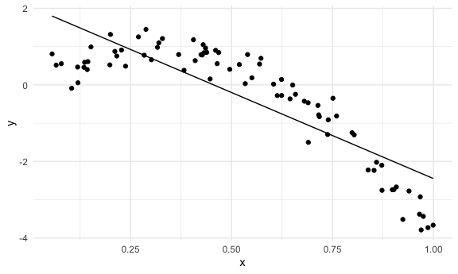

cross\_validation
================
Wenshan Qu (wq2160)
11/16/2021

``` r
library(tidyverse)
```

    ## ── Attaching packages ─────────────────────────────────────── tidyverse 1.3.1 ──

    ## ✓ ggplot2 3.3.5     ✓ purrr   0.3.4
    ## ✓ tibble  3.1.4     ✓ dplyr   1.0.7
    ## ✓ tidyr   1.1.3     ✓ stringr 1.4.0
    ## ✓ readr   2.0.1     ✓ forcats 0.5.1

    ## ── Conflicts ────────────────────────────────────────── tidyverse_conflicts() ──
    ## x dplyr::filter() masks stats::filter()
    ## x dplyr::lag()    masks stats::lag()

``` r
library(viridis)
```

    ## Loading required package: viridisLite

``` r
library(modelr)
library(mgcv) ## For fitting nonlinear models
```

    ## Loading required package: nlme

    ## 
    ## Attaching package: 'nlme'

    ## The following object is masked from 'package:dplyr':
    ## 
    ##     collapse

    ## This is mgcv 1.8-38. For overview type 'help("mgcv-package")'.

``` r
knitr::opts_chunk$set(
  fig.width = 6,
  fig.asp = .6,
  out.width = "90%"
)

theme_set(theme_minimal() + theme(legend.position = "bottom"))

options(
  ggplot2.continuous.colour = "viridis",
  ggplot2.continuous.fill = "viridis"
)

scale_colour_discrete = scale_colour_viridis_d
scale_fill_discrete = scale_fill_viridis_d
```

## Simulate a dataset

``` r
nonlin_df = 
  tibble(
    id = 1:100,
    x = runif(100, 0, 1),
    y = 1 - 10 * (x - .3) ^ 2 + rnorm(100, 0, .3)
  )

nonlin_df %>% 
  ggplot(aes(x = x, y = y)) + 
  geom_point()
```


## Create splits by hand; plot; fit some models

``` r
train_df = sample_n(nonlin_df, 80)
## test data should not in the trainning data
test_df = anti_join(nonlin_df, train_df, by = "id")

ggplot(train_df, aes(x = x, y = y)) +
  geom_point() +
  geom_point(data = test_df, color = "red")
```


Fit my model:

``` r
linear_mod = lm(y ~ x, data = train_df)
smooth_mod = mgcv::gam(y ~ s(x), data = train_df)
wiggly_mod = mgcv::gam(y ~ s(x, k = 30), sp = 10e-6, data = train_df) ## more complex
```

Plot the results

``` r
train_df %>% 
  add_predictions(smooth_mod) %>% 
  ggplot(aes(x = x, y = y)) +
  geom_point() +
  geom_line(aes(y = pred))
```


``` r
train_df %>% ## putting to much stuff in my model!! Not good!
  add_predictions(wiggly_mod) %>% 
  ggplot(aes(x = x, y = y)) +
  geom_point() +
  geom_line(aes(y = pred))
```


``` r
train_df %>% ## putting to little things in my model!! Not good!
  add_predictions(linear_mod) %>% 
  ggplot(aes(x = x, y = y)) +
  geom_point() +
  geom_line(aes(y = pred))
```



Quantify the results

``` r
rmse(linear_mod, test_df)
```

    ## [1] 0.7606713

``` r
rmse(smooth_mod, test_df)
```

    ## [1] 0.2921749

``` r
rmse(wiggly_mod, test_df)
```

    ## [1] 0.3748754

## CV iteratively

use `modelr::crossv_mc`

``` r
cv_df = 
   crossv_mc(nonlin_df, 100) ## train 100 times

## let's check!
cv_df %>%  pull(train) %>% .[[1]] %>%  as_tibble() ## `[[1]]` means give me the first element in the list.
```

    ## # A tibble: 79 × 3
    ##       id      x       y
    ##    <int>  <dbl>   <dbl>
    ##  1     1 0.136   0.589 
    ##  2     2 0.199   0.522 
    ##  3     3 0.550   0.185 
    ##  4     4 0.604   0.0194
    ##  5     5 0.0785  0.554 
    ##  6     6 0.444   0.622 
    ##  7     7 0.986  -3.73  
    ##  8     8 0.738  -1.30  
    ##  9     9 0.895  -2.51  
    ## 10    10 0.270   1.25  
    ## # … with 69 more rows

``` r
## continue ...
cv_df = 
   crossv_mc(nonlin_df, 100) %>% 
  mutate(
    train = map(train, as_tibble),
    test = map(test, as_tibble)
  )
```

Let’s fit some models

``` r
cv_df %>% 
  mutate(
    linear_mod = map(.x = train, ~lm(y ~ x, data = .x))
  ) %>% 
  mutate(
    rsme_linear = map2_dbl(.x = linear_mod, .y = test, ~rmse(model = .x, data = .y)) ## `dbl` could give us number version.
  )
```

    ## # A tibble: 100 × 5
    ##    train             test              .id   linear_mod rsme_linear
    ##    <list>            <list>            <chr> <list>           <dbl>
    ##  1 <tibble [79 × 3]> <tibble [21 × 3]> 001   <lm>             0.710
    ##  2 <tibble [79 × 3]> <tibble [21 × 3]> 002   <lm>             0.766
    ##  3 <tibble [79 × 3]> <tibble [21 × 3]> 003   <lm>             0.840
    ##  4 <tibble [79 × 3]> <tibble [21 × 3]> 004   <lm>             0.930
    ##  5 <tibble [79 × 3]> <tibble [21 × 3]> 005   <lm>             0.702
    ##  6 <tibble [79 × 3]> <tibble [21 × 3]> 006   <lm>             0.874
    ##  7 <tibble [79 × 3]> <tibble [21 × 3]> 007   <lm>             0.873
    ##  8 <tibble [79 × 3]> <tibble [21 × 3]> 008   <lm>             0.834
    ##  9 <tibble [79 × 3]> <tibble [21 × 3]> 009   <lm>             0.595
    ## 10 <tibble [79 × 3]> <tibble [21 × 3]> 010   <lm>             0.726
    ## # … with 90 more rows

``` r
cv_df = 
  cv_df %>% 
    mutate(
      linear_mod = map(.x = train, ~lm(y ~ x, data = .x)),
      smooth_mod = map(.x = train, ~gam(y ~ s(x), data = .x)),
      wiggly_mod = map(.x = train, ~gam(y ~ s(x, k = 30), sp = 10e-6, data = .x))
    ) %>% 
    mutate(
      rmse_linear = map2_dbl(.x = linear_mod, .y = test, ~rmse(model = .x, data = .y)),
      rmse_smooth = map2_dbl(.x = smooth_mod, .y = test, ~rmse(model = .x, data = .y)),
      rmse_wiggly = map2_dbl(.x = wiggly_mod, .y = test, ~rmse(model = .x, data = .y))
    )
```

look at output

``` r
cv_df %>% 
  select(.id, starts_with("rmse")) %>% 
  pivot_longer(
    rmse_linear:rmse_wiggly,
    names_to = "model",
    values_to = "rmse",
    names_prefix = "rmse_"
  ) %>% 
  ggplot(aes(x = model, y = rmse)) +
  geom_point()
```


## Child growth

``` r
child_growth = 
  read_csv("./nepalese_children.csv")
```

    ## Rows: 2705 Columns: 5

    ## ── Column specification ────────────────────────────────────────────────────────
    ## Delimiter: ","
    ## dbl (5): age, sex, weight, height, armc

    ## 
    ## ℹ Use `spec()` to retrieve the full column specification for this data.
    ## ℹ Specify the column types or set `show_col_types = FALSE` to quiet this message.

``` r
child_growth %>% 
  ggplot(aes(x = weight, y = armc)) +
  geom_point(alpha = .2)
```


Consider candidate models

``` r
child_growth = 
  read_csv("./nepalese_children.csv") %>% 
  mutate(
    weight_cp = (weight > 7) * (weight - 7) ## this is for pwl_mod
    ## we choose 7 as the change point
  )
```

    ## Rows: 2705 Columns: 5

    ## ── Column specification ────────────────────────────────────────────────────────
    ## Delimiter: ","
    ## dbl (5): age, sex, weight, height, armc

    ## 
    ## ℹ Use `spec()` to retrieve the full column specification for this data.
    ## ℹ Specify the column types or set `show_col_types = FALSE` to quiet this message.

``` r
linear_mod = lm(armc ~ weight, data = child_growth)
pwl_mod = lm(armc ~ weight + weight_cp, data = child_growth) ## piece wise linear model?
smooth_mod = gam(armc ~ s(weight), data = child_growth)
```

``` r
child_growth %>% 
  add_predictions(pwl_mod) %>% 
  ggplot(aes(x = weight, y = armc)) +
  geom_point(alpha = .2) +
  geom_line(aes(y = pred), color = "red")
```


Use CV to compare models.

``` r
cv_df =
  crossv_mc(child_growth, 100) %>% 
  mutate(
    train = map(train, as_tibble),
    test = map(test, as_tibble))
```

Fit models and extract RMSE

``` r
cv_df = 
  cv_df %>% 
  mutate(
    linear_mod  = map(train, ~lm(armc ~ weight, data = .x)),
    pwl_mod     = map(train, ~lm(armc ~ weight + weight_cp, data = .x)),
    smooth_mod  = map(train, ~gam(armc ~ s(weight), data = as_tibble(.x)))) %>% 
  mutate(
    rmse_linear = map2_dbl(linear_mod, test, ~rmse(model = .x, data = .y)),
    rmse_pwl    = map2_dbl(pwl_mod,    test, ~rmse(model = .x, data = .y)),
    rmse_smooth = map2_dbl(smooth_mod, test, ~rmse(model = .x, data = .y)))
```

``` r
cv_df %>% 
  select(starts_with("rmse")) %>% 
  pivot_longer(
    everything(),
    names_to = "model", 
    values_to = "rmse",
    names_prefix = "rmse_") %>% 
  mutate(model = fct_inorder(model)) %>% 
  ggplot(aes(x = model, y = rmse)) + 
  geom_violin()
```


linear model is missing important values, do not enough.
